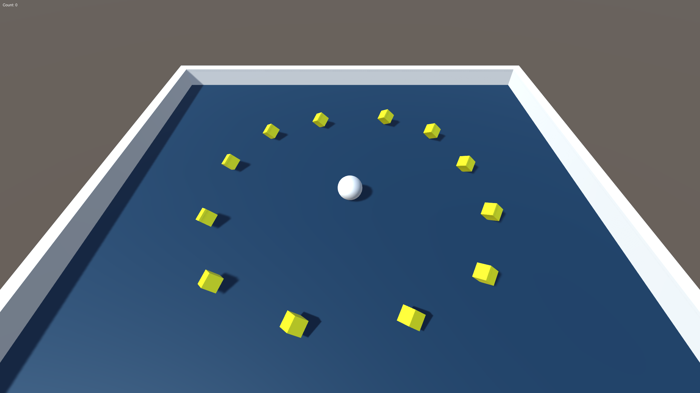
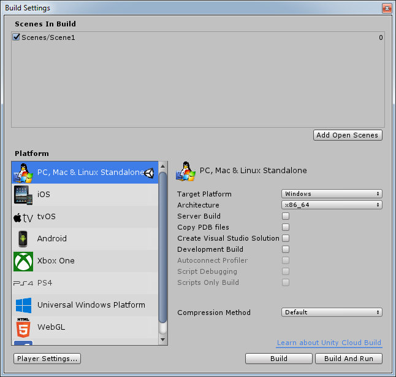

# Roll-a-Ball
Roll-a-Ball Unity tutorial from:

https://learn.unity.com/project/roll-a-ball-tutorial

## Prerequisites
(None)

## Build
File > Build Settings... > PC, Mac & Linux Standalone

Scenes In Build: Scenes/Scene1

Build in `Roll-a-Ball/Builds`

## Run
Run `Roll-a-Ball/Builds/Roll a Ball.exe`

## Test
(None)
